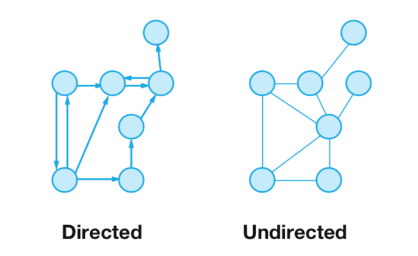
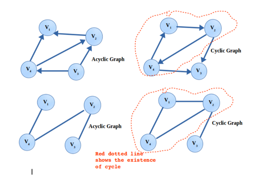
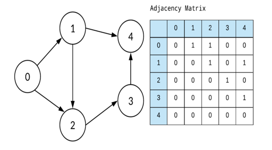
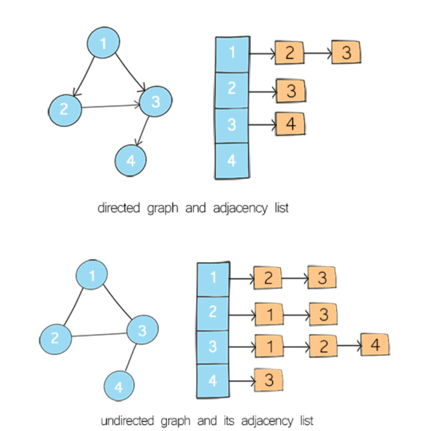

# 그래프

- 트리 
  - 그래프의 한 형테
  - 루트가 존재
  - 아래로 차일드 노드들이 있음(진입지점이 하나)
  - 노드를 연결하는 엣지가 존재
  - 사이클이 없이 아래로만 흐르는 그래프(트리는 방향이 있으나 아래로만 흐르니 방향화살표 생략)
  - 
  
- 그래프
  - 엣지의 방향이 위아래로 자유롭거나 없을 수 있고
  - 진입지점이 여러개가 될 수 있음
  - 동일한 레벨의 노드와 연결이 되거나 자기 자신을 가리키기도 하며 엣지들이 연결되어 원형태가 되기도 함
  - 방향이 있는 그래프(Directed Graph) / 방향이 없는 그래프(Undirected Graph)
  
  - 엣지가 원형으로 연결된 그래프(Cyclic Graph)/ 원형연결이 없는 그래프(Acyclic)
  
  - 그래프를 표현하는 방법
    - Adjacency Matrix
      - 이차원배열(표)에 표현하는 방법
      - 서로 연결된 노드가 있으면 1, 아니면 0
      
    - Adjacency List
      - 배열에 노드들을 나열하고 관계를 링크드 리스트로 표현
      - 
      - 방향성이 없는 그래프의 경우 엣지의 갯수가 m일때 총 노드의 갯수는 2m개가 생성됨(서로 연결이므로)
    
  
- 그래프를 검색하는 방법
  - Depth-First Search(DFS)
    - inorder, preorder, post order
  - Breadth-First Search(BFS)

그래프의 구현

